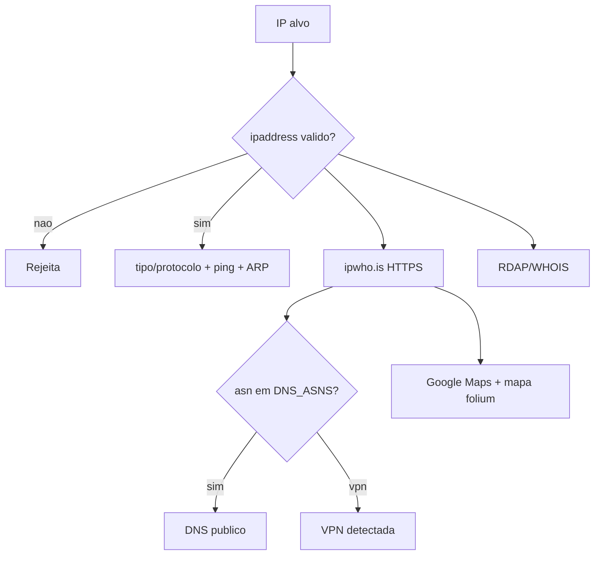

# 🛰️ IP-Intelligence-Tool — OSINT de Endereços IP
<p align="center">
  
  <a href="https://github.com/panda12332145/IP-Intelligence-Tool/commits/main"></a>
  <a href="https://github.com/panda12332145/IP-Intelligence-Tool"></a>
  
</p>
---
> ⚠️ **Uso defensivo/educacional.** Consulte IPs que você administra ou tem autorização — reconhecimento excessivo contra alvos de terceiros pode configurar ilícito.

---
## 🔖 Resumo

Ferramenta de **OSINT** que cruza várias fontes sobre um IP: tipo (público/privado) e protocolo, **latência** (ping), **MAC** (rede local via ARP), detecção de **VPN/DNS público** por ASN, **geolocalização** com link do Google Maps e mapa HTML (folium), dados de **ipwho.is** e **RDAP/WHOIS** — tudo validado contra injeção de comando.

### ✨ Funcionalidades Principais

- ✅ Validação de IP antes de qualquer subprocesso (anti injeção, sem `shell=True`)
- ✅ Latência via ping e MAC via ARP (quando na rede local)
- ✅ Detecção de VPN/DNS público por ASN (13335/15169/14992) com fallback RDAP
- ✅ Geolocalização: link Google Maps + mapa HTML gerado com folium
- ✅ Dados completos ipwho.is (HTTPS) + RDAP/WHOIS
- ✅ CLI com argumento opcional `--map`

## 📽 Demonstração

```text
$ python main.py 1.1.1.1 --map
🔍 Analisando: 1.1.1.1
  Tipo: Público | Protocolo: IPv4
  Latência: 12 ms
  🛰️ Detecção VPN/DNS: DNS público
  📡 ipwho.is: Brisbane/AU, ASN 13335 ...
  🗺️  Mapa: https://www.google.com/maps?q=-27.46,153.02
  🗺️  Mapa HTML gerado: mapa_ip.html
```

## ⚙️ Explicação das Partes Importantes

### Validação + subprocessos seguros (`src/ip_analyzer.py`)

```python
def get_latency(ip):
    if not is_valid_ip(ip):          # ipaddress rejeita '1.1.1.1; rm -rf /'
        return None
    cmd = ["ping", "-c", "1", ip]    # lista de args, SEM shell=True
    subprocess.run(cmd, timeout=10, check=True)
```

> O bug do script original era `shell=True` com o IP interpolado — qualquer entrada maliciosa virava comando. Agora a validação bloqueia antes.

### Detecção VPN/DNS por ASN

```python
DNS_ASNS = {15169, 13335, 14992}   # Google, Cloudflare, OpenDNS
def _asn_int(value):                # API devolve '13335' (string!)
    try: return int(value)
    except: return None
```

> Normalização do ASN (string→int) foi o que corrigiu a detecção: 1.1.1.1 e 8.8.8.8 agora retornam 'DNS público'.

### Mapa (`src/geomap.py`)

```python
folium.Map(location=[lat, lon]).add_to(mapa)
folium.Marker([lat, lon], icon=Icon(color="green"))
```

> Folium gera um HTML autossuficiente — abra no navegador sem servidor.

## 🔄 Fluxo de Trabalho / Arquitetura



## 📂 Estrutura do Projeto

```plaintext
IP-Intelligence-Tool/
├── main.py                  # CLI (ip opcional, --map, --out)
├── src/
│   ├── ip_analyzer.py       # tipo, ping, ARP, ipwho.is, RDAP, VPN/DNS
│   ├── geomap.py            # mapa folium + fallback ipify/ipinfo
│   ├── reporter.py          # relatório no terminal
│   └── main.py              # argparse
├── tests/test_ip_tool.py    # 4 testes (validação + smoke ao vivo)
├── requirements.txt
└── README.md
```

## 🛠️ Tecnologias

| Ferramenta | Uso |
|---|---|
| **Python 3** | Linguagem |
| **requests** | APIs HTTPS |
| **ipwhois** | RDAP/WHOIS |
| **folium** | Mapas HTML |

## ▶️ Instalação

```bash
git clone https://github.com/panda12332145/IP-Intelligence-Tool.git
cd IP-Intelligence-Tool
pip install -r requirements.txt
```

## 🚀 Execução

```bash
python main.py 1.1.1.1          # análise direta
python main.py 8.8.8.8 --map    # gera mapa_ip.html
python main.py                  # IP via prompt

# testes:
python tests/test_ip_tool.py
```

## 🧪 Testes

4 testes: validação (inclui tentativas de injeção `; rm -rf /`), tipos de IP, subprocessos que rejeitam inválidos e smoke test ao vivo da API ipwho.is.

## ⚠️ Limitações

- Latência/MAC dependem do ambiente (rede local/host sem permissão de ping)
- Geolocalização é aproximada (por ASN/cidade)
- APIs públicas têm rate limit

## 🚀 Roadmap

- [ ] Modo lote (lista de IPs → CSV)
- [ ] Histórico de consultas
- [ ] Detecção de proxy/ Tor exit nodes
- [ ] Export do relatório em JSON

## 📄 Licença

Todos os direitos reservados ao autor.

---

## 👾 Autor

<p align="center">
  
</p>

<p align="center">Feito por <strong>Panda12332145</strong> 👋🏽</p>

---

## 🧑‍💻 Sobre Mim

Sou apaixonado por **Física Teórica, Cibersegurança e Desenvolvimento de Sistemas**. Tenho grande interesse em programação de baixo nível, engenharia reversa, automação, sistemas Windows, criptografia e segurança ofensiva. Também gosto bastante de música, filosofia e computação avançada.

---

## 🌐 Redes

* **Site:** [https://panda-h0me.netlify.app/](https://panda-h0me.netlify.app/)
* **YouTube:** [https://www.youtube.com/@X86BinaryGhost](https://www.youtube.com/@X86BinaryGhost)
* **Instagram:** [https://www.instagram.com/01pandal10/](https://www.instagram.com/01pandal10/)
* **GitHub:** [https://github.com/panda12332145](https://github.com/panda12332145)
* **LinkedIn:** [linkedin.com/in/athos-da-boanergis](https://www.linkedin.com/in/athos-d%C3%A3-boanergis-5585a4288/)

---

## 🚀 Áreas de Interesse

* **Cibersegurança Avançada** 🔒
* **Hacking & Engenharia Reversa** 💻
* **Computação de Baixo Nível** 🖥️
* **Matemática e Física Teórica** 📐⚛️
* **Desenvolvimento de Ferramentas de Segurança** 🛠️

_"Conhecimento é poder, e domínio técnico vem da compreensão profunda dos sistemas."_

---

## 📞 Contato & Suporte

Para colaborações, dúvidas ou sugestões:

📧 **E-mail:** [athos.cybersec@gmail.com](mailto:athos.cybersec@gmail.com)

🐛 **Reportar Bug:** [Abrir Issue](https://github.com/panda12332145/IP-Intelligence-Tool/issues)

💡 **Sugerir Melhoria:** [Discussions](https://github.com/panda12332145/IP-Intelligence-Tool/discussions)
